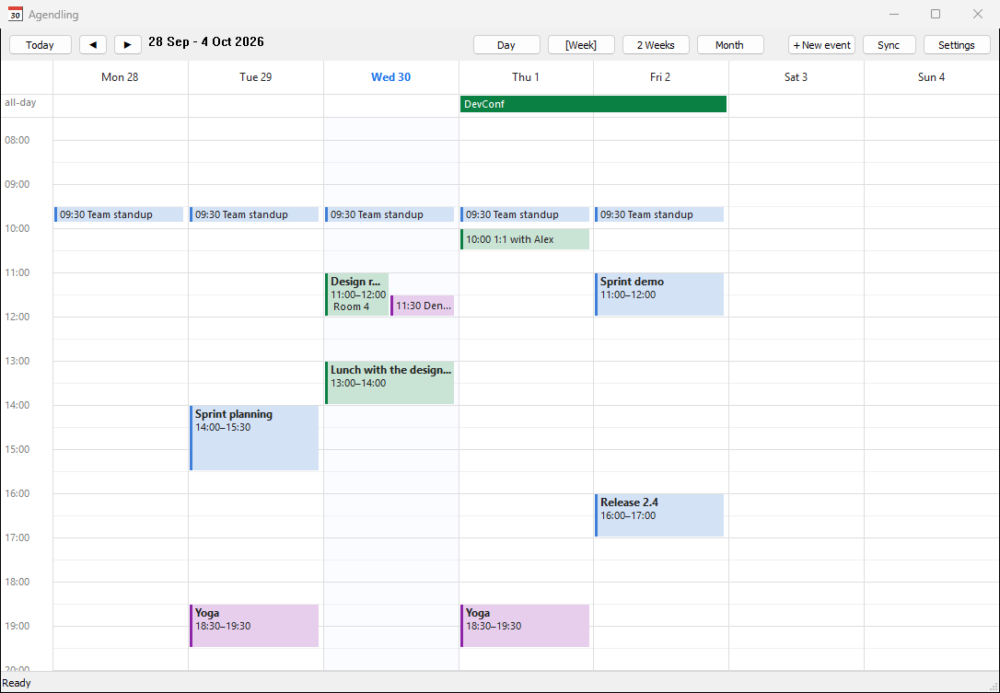
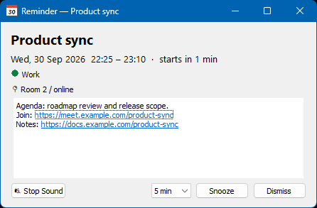
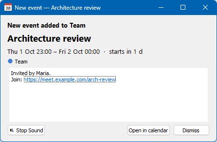
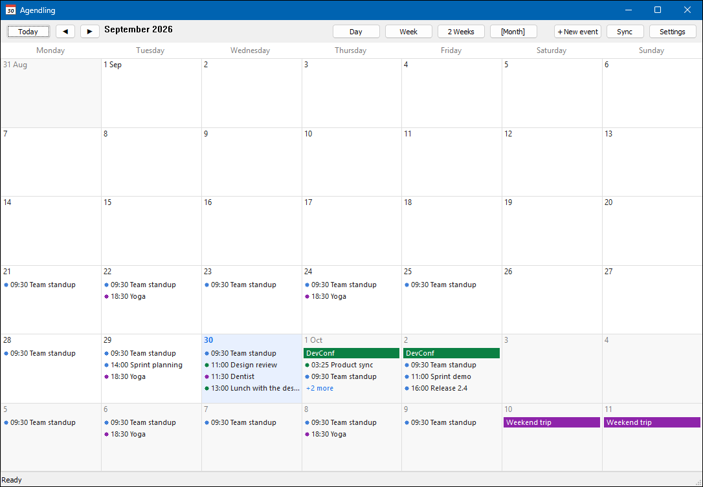
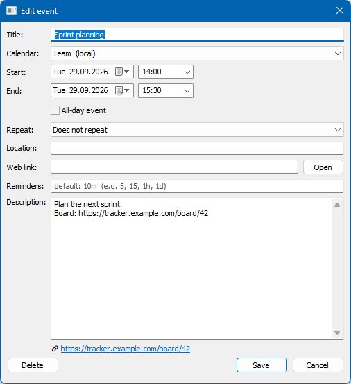
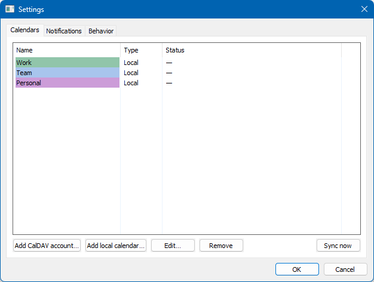
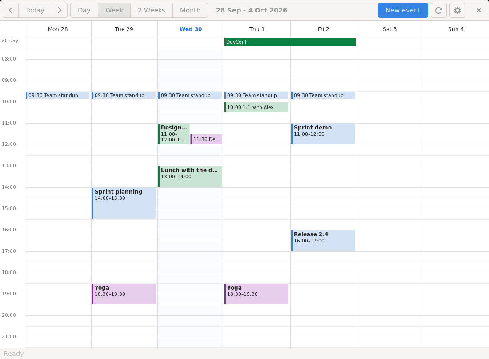

<p align="center">
  
</p>

<h1 align="center">Agendling</h1>

<p align="center">
  <b>A tiny desktop calendar that stays out of your way until a meeting needs you.</b><br>
  CalDAV sync · local calendars · loud-when-it-matters reminders · new-meeting alerts<br>
  Windows and Linux · single binary · ~26 MB of RAM · zero CPU when idle
</p>

<p align="center">
  <a href="https://github.com/Georgy-Garnov/agendling/actions/workflows/ci.yml"></a>
  <a href="https://github.com/Georgy-Garnov/agendling/releases"></a>
  <a href="LICENSE"></a>
  
</p>

<p align="center">
  
</p>

*Agendling* = *agenda* + *-ling* (as in *duckling*): a small agenda. It lives in the system tray,
keeps all your calendars in one colour-coded view, and makes sure you never miss the start of a
meeting or a freshly booked one.

## Why Agendling?

**Light as a feather**
- **About 26 MB of RAM** when idle on Windows: a native Win32 UI with no browser engine and no runtime.
- **Zero CPU while waiting.** One timer is armed for the next reminder; there's no polling loop.
  Sync runs on its own schedule in the background and never blocks the window.
- **One self-contained binary.** The Windows build needs no installer, no .NET, no Visual C++
  runtime and no CGO: just `agendling.exe`.

**Notifications you actually notice**
- **Reminder popups stay on top** of all windows. They show the title, time and calendar, plus the
  description with **clickable meeting links**.
- **Your own sound** (MP3 or WAV) or a built-in chime. It can repeat until you react. **Stop Sound**
  cuts it off instantly, **Snooze** brings the popup back after N minutes, and **Dismiss** closes it.
- **New-meeting alerts:** when a sync finds an event that wasn't there before, such as a fresh
  invitation, Agendling plays the sound and shows a "New event" popup.
- **Missed reminders are caught up.** If the computer was off, reminders for events that haven't
  ended yet fire at start-up. Each reminder fires only once, even across restarts.

**A real calendar**
- **Views:** Day and Week (hourly grid), 2 Weeks, and Month, with every calendar overlaid and
  colour-coded.
- **Two-way CalDAV sync** for several accounts at once (Nextcloud, Fastmail, iCloud, Radicale,
  Baïkal and others), plus **local calendars** that never leave your machine.
- **Full event editing:** title, location, link, description, all-day events, repeats and custom
  reminder times. Changes go back to the server on the next sync.
- **Correct time zones:** recurring events keep their wall-clock time in the zone they were
  created in, even across daylight-saving changes.

## Screenshots

| Reminder popup | New-meeting alert |
|---|---|
|  |  |

| Month view | Event editor |
|---|---|
|  |  |

| Settings | Linux (GTK 3) |
|---|---|
|  |  |

## Installation

### Windows 10 / 11

1. Download `agendling-<version>-windows-amd64.zip` from
   [Releases](https://github.com/Georgy-Garnov/agendling/releases).
2. Unzip it anywhere, for example `%LocalAppData%\Programs\Agendling`, and run `agendling.exe`.
3. Optional: in **Settings → Behavior**, enable **Run at Windows startup** and **Start minimized**.

There is no installer; to uninstall, see [Data and privacy](#data-and-privacy).

> Windows SmartScreen may warn about an unrecognised app, because releases aren't code-signed.
> Choose *More info → Run anyway*, or [build it yourself](#building-from-source).

### Linux (Ubuntu 22.04+ and other GTK 3 desktops)

1. Download `agendling-<version>-linux-amd64.tar.gz` from
   [Releases](https://github.com/Georgy-Garnov/agendling/releases) and extract it.
2. Make sure the runtime libraries are present. They ship with every Ubuntu desktop:
   ```sh
   sudo apt install libgtk-3-0 libasound2
   ```
3. Run `./agendling-linux-amd64`. To start it automatically, enable
   **Settings → Behavior → Run at login**; you can also copy the binary to `~/.local/bin`.

The tray icon uses the StatusNotifierItem/AppIndicator protocol. On Ubuntu's GNOME the
*Ubuntu AppIndicators* extension is enabled by default; on other GNOME setups install
*AppIndicator and KStatusNotifierItem Support*. KDE Plasma works out of the box. Without a tray,
closing the window minimizes it instead of hiding it.

## Usage guide

### First start

Agendling starts with an empty local calendar called **Personal**. To see your existing calendars:

1. Open **Settings → Calendars → Add CalDAV account…**
2. Enter a name, the server URL, your username and an **app password** (see the
   [provider table](#caldav-providers)).
3. Click **Test connection**. It should say how many calendars it found.
4. Choose a colour and a sync interval, then click **OK**. The first sync starts immediately.

You can add as many accounts and local calendars as you like. Untick **Enabled** to hide a
calendar without deleting it.

### Navigating

| Action | Mouse | Keyboard |
|---|---|---|
| Previous / next period | ◀ ▶ buttons, or the wheel in month and 2-week views | ← → or PgUp / PgDn |
| Jump to today | **Today** | T or Home |
| Switch view | **Day / Week / 2 Weeks / Month** | D / W / M |
| Scroll hours (day and week views) | mouse wheel | ↑ ↓ |
| Open a day | click the day header or "+N more" | |
| Edit an event | click it | |
| New event | **+ New event**, or double-click an empty slot | N |

Double-clicking the all-day strip creates an all-day event. Double-clicking a month cell creates
an event at 09:00 that day.

### Events

The editor covers title, calendar, start and end, all-day, repeat (daily, weekdays, weekly,
every 2 weeks, monthly, yearly; custom rules from the server are kept), location, web link,
reminders and description. Links in the description appear as clickable links under the text
field.

- **Reminders** take a comma-separated list such as `5, 15, 1h, 1d` (units: `m`, `h`, `d`, `w`).
  Leave the field empty to use the default reminders from Settings.
- **Recurring events:** editing changes the whole series. **Delete** asks whether to remove only
  this occurrence or the entire series.
- **Moving an event** to another calendar (even from a CalDAV account to a local one) moves the
  whole series.

### Reminders and alerts

When a reminder is due, a popup appears on top of all windows:

- **Stop Sound** silences it but keeps the popup open.
- **Snooze** (1–60 minutes; the default is set in Settings) closes it and brings it back later.
- **Dismiss**, or closing the window, stops the sound and closes the popup.

Clicking a link in the popup opens it in your default browser.

**New-meeting alerts** use the same popup, titled *New event added to …*, with an
**Open in calendar** button. At most three popups are shown per sync; any more are summarised in
one message. The first sync of a newly added account never triggers them. You can turn them off
in **Settings → Notifications**.

### Sound

In **Settings → Notifications** choose an MP3 or WAV file, or leave the field empty for the
built-in chime. **▶ Test** plays it and **■ Stop** stops it. With *Repeat the sound until stopped*,
the sound loops for up to 3 minutes. **Mute Notifications** in the tray menu silences all sounds;
popups still appear.

### Tray menu

**Open Agendling**, **Sync Now**, **Mute Notifications**, **Settings**, **Exit**. Closing the main window
keeps Agendling running in the tray; use **Exit** to quit. Launching Agendling again while it's
running brings its window to the front instead of starting a second copy.

## CalDAV providers

Agendling uses standard CalDAV (RFC 4791) with basic authentication. Most providers require an
*app password* rather than your main password.

| Provider | Server URL | Password |
|---|---|---|
| Nextcloud | `https://your.host/remote.php/dav` | App password: *Settings → Security → Devices & sessions* |
| Fastmail | `https://caldav.fastmail.com/dav/` | App password with CalDAV access |
| iCloud | `https://caldav.icloud.com` | App-specific password from appleid.apple.com |
| Radicale | `https://your.host:5232/` | Your Radicale password |
| Baïkal | `https://your.host/dav.php` | Your Baïkal password |
| Other servers | The server's CalDAV root, or the URL of a single calendar | Usually an app password |

- **A root URL** makes Agendling discover all event calendars of the account and show them
  together. New events go into the first one.
- **A URL pointing at one calendar collection** syncs only that calendar.
- **Google Calendar is not supported:** Google's CalDAV endpoint only accepts OAuth 2.0.

**How sync works:** local changes are pushed first, then events from 6 months back to 2 years
ahead are pulled. Local edits waiting to be pushed are never overwritten by a pull. Network or
server errors appear in the status bar and as a one-time notification; the app keeps working
offline.

## Data and privacy

| | Windows | Linux |
|---|---|---|
| Data directory | `%AppData%\Agendling\` | `~/.config/Agendling/` |
| Database | `calendar.db` (SQLite) | `calendar.db` (SQLite) |
| Log | `agendling.log` | `agendling.log` |
| Passwords | Encrypted with Windows DPAPI, tied to your user account | AES-GCM; the key is kept in the desktop keyring (GNOME Keyring / KWallet), or in a user-only key file if no keyring runs |
| Autostart | `HKCU\Software\Microsoft\Windows\CurrentVersion\Run` → `Agendling` | `~/.config/autostart/agendling.desktop` |

Agendling talks only to the CalDAV servers you configure. It has no telemetry, no update checks
and no accounts. To uninstall, exit the app, disable autostart in Settings (or delete the entry
above), then delete the binary and the data directory.

## Building from source

### Requirements

- Go **1.26** or newer
- `make` (optional; the commands below show the plain `go` equivalents)
- For the Linux build only: `pkg-config` and the GTK 3 headers:
  `sudo apt install pkg-config libgtk-3-dev`

### Build

```sh
git clone https://github.com/Georgy-Garnov/agendling.git
cd agendling

make windows   # bin/agendling.exe          (works on Windows, Linux, macOS; no C compiler)
make linux     # bin/agendling-linux-amd64  (on Linux)
make test      # unit and integration tests
make vet       # static checks for both platforms
make help      # all targets
```

Without `make`:

```sh
# Windows binary, from any OS
GOOS=windows GOARCH=amd64 CGO_ENABLED=0 go build -ldflags "-H windowsgui -s -w" -o bin/agendling.exe ./cmd/agendling

# Linux binary, on Linux
CGO_ENABLED=1 go build -ldflags "-s -w" -o bin/agendling-linux-amd64 ./cmd/agendling
```

On Windows you can also run `.\build.ps1`.

`cmd/agendling/rsrc_windows_amd64.syso` embeds the Windows manifest (Common Controls v6 and
per-monitor DPI awareness), which the UI toolkit needs. It's committed; regenerate it with
`make syso` if you change `agendling.manifest`.

### Releases

Pushing a tag like `v1.0.0` runs the [release workflow](.github/workflows/release.yml). It runs
the tests, builds both binaries with the version embedded (`agendling --version`), packages them
with `LICENSE` and `THIRD_PARTY_NOTICES.md`, and publishes a GitHub release with checksums.

## Architecture

```
cmd/agendling       entry points (Windows / Linux), manifest resource, single-instance guard
internal/core       shared app logic: event operations, editor validation, view geometry, text helpers
internal/ui         Windows UI (lxn/walk): calendar views, tray, popups, editor, settings
internal/gtkui      Linux UI (gotk3, GTK 3): the same, with Cairo/Pango drawing and an AppIndicator tray
internal/caldav     discovery, two-way sync, background workers, server compatibility fixes
internal/ics        iCalendar ↔ model conversion, VTIMEZONE generation
internal/recur      RRULE / EXDATE / RECURRENCE-ID expansion in the event's own time zone
internal/scheduler  single-timer reminder scheduler with snooze and catch-up
internal/storage    SQLite persistence (modernc.org/sqlite, pure Go)
internal/audio      MP3/WAV playback with instant stop (oto v3 + beep decoders), built-in chime
internal/secret     credential encryption (DPAPI / keyring + AES-GCM)
internal/appinfo    product name, version, data directory
tools/notices       generates THIRD_PARTY_NOTICES.md
```

Everything below `internal/ui` and `internal/gtkui` is shared, so both builds behave the same.

**Built with:** [lxn/walk](https://github.com/lxn/walk), [gotk3](https://github.com/gotk3/gotk3),
[emersion/go-webdav](https://github.com/emersion/go-webdav),
[emersion/go-ical](https://github.com/emersion/go-ical),
[teambition/rrule-go](https://github.com/teambition/rrule-go),
[modernc.org/sqlite](https://gitlab.com/cznic/sqlite), [ebitengine/oto](https://github.com/ebitengine/oto),
[gopxl/beep](https://github.com/gopxl/beep) and [fyne.io/systray](https://github.com/fyne-io/systray).

## Known limitations

- **Google Calendar** needs OAuth, which isn't implemented.
- **Editing a recurring event** changes the whole series; single occurrences can be deleted but
  not edited separately.
- **Tasks (VTODO) and CardDAV contacts** aren't supported.
- **Memory on Linux:** the GTK 3 build needs about 65 MB of RAM, which is typical for GTK apps.
  The 26 MB figure applies to Windows.
- **Unsigned releases:** Windows SmartScreen may warn on first launch.

## Contributing

Bug reports, ideas and pull requests are welcome. Please read [CONTRIBUTING.md](CONTRIBUTING.md) first.

## License

Agendling is released under the [MIT License](LICENSE): free to use, modify and redistribute,
including commercially. Third-party components and their licenses are listed in
[THIRD_PARTY_NOTICES.md](THIRD_PARTY_NOTICES.md); all of them are permissive (MIT, BSD, ISC,
Apache-2.0).
